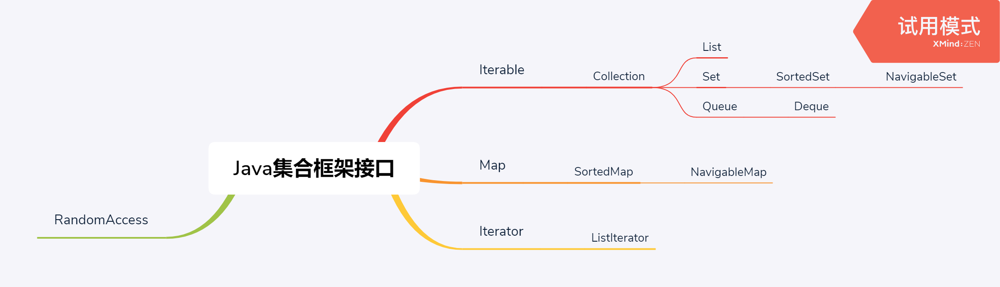
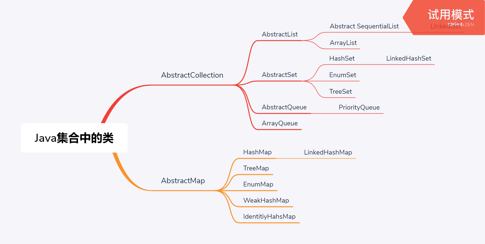

# collection

java集合的操作

## Java集合框架

### 将集合接口与实现分离

在研究api文档时其中的一些abstract类是位类库实现者所准备的（如果像要实现自己的集合类那么用这个抽象类会比实现那些所有的接口中的方法要好很多。）

### collection接口

Collection 接口有两个基本方法。

```java
public interface Collection<E>{
    boolean add(E elemnet);//集合中不允许有重复的元素如果插入重复的元素就会返回false
    Iterator<E> iterator();//返回一个实现了iterator接口的对象。
 
    ...//还有方法在之后介绍。
}
```


### 迭代器

Iterator 接口的4个方法

```java
public interface Iterator<E> {
    E next();
    boolean hasnext();
    void remove();
    default void forEachRemaining(Consume<? super E> action);//这里就是用了向上的限定的泛型。。。
}

```

foreache支持任何实现了iterator接口的类。

使用forEachRamaing方法

```java
iterator.forEachRemaing(element-> do somthing with element );
//为这个方法传递一个λ表达式。
```

iterator 的remove()方法：

删除上次调用next方法时 返回的元素。

```java
//必须在next()方法之后删除，必须用next方法越过这个数才能用remove删除
it.remove();
it.remove();//wrong
//
it.next();
it.remove();
```


### 泛型实用方法

Collection 的实用方法

```java
int size();
boolean isEmpty();
boolean contains();
boolean containsAll(Colleaction<?> c);//注意这里使用的不限定的通配符，因为这个Collection指示他可以接受任意参数类型的集合（不必和接口的参数类型相同）
boolean equals(Object other);
boolean remove(Object obj);//删除 与obj相同的对象。
boolean removeIf();
boolean clear(); //删除集合的所有元素。
Object[] toArray();//返回集合的对象数组；
<T> T[] toArray(T[] arrayToFill);//返回这个集合的对象数组，如果arrayToFill足够大，就将集合中的元素全部填入其中，剩余空间用null补齐。否则分配一个数组，成员类型与arrayToFill的成员类型相同，长度与集合元素相同。（这返回的是一个安全的数组，记住了这个泛型类型）

```


### 集合框架中的接口




RandomAccess 接口不包含任何的方法，避免对链表完成随机访问操作，可以用它来测试一个特定的集合是否支持高效的随机访问：

```java
if(c instanceof RandomAccess ){
    do some thing ;
}else{
    do other thing ;
}
```

hashCode 方法的定义要保证包含相同元素的两个集会得到相同的散列码。

SortedSet 和SortedSet 接口会提供用于排序的比较器对象，这两个接口定义了可以得到集合子集视图的方法。

NavigableSet 和 NavigableMap ,其中包含一些用于搜索和遍历有序集和映射的方法。（TreeSet 和TreeMap 都实现了这些接口）。

### 具体集合

（并没有包括后面的线程安全集合）




### 链表

实现了ListIterator接口。

链表执行add()操作时会将所添加的数据添加到链表的表尾 。

#### ListIterator

 LinkList的add方法与Collection.add方法不同，这个不返回boolean类型的值，它假定添加操作总会改变链表。但是对于加在中间的元素要使用

```java
List<String> list=new LinkedList();
ListIterator iterator = list.listIterator();
iterator.next();
iterator.add("xxx");//在这个next的后面添加元素。
```

这个LinkedList 的listIterator()方法是继承自 它的抽象类（AbstractList）这一点让人很奇怪.因为abstractList作为ArrayList和LinkedList的高层实现，它并不知道这两个具体实现的子类的实现方式是通过数组还是通过链表。但是它却提供它的迭代器。？？？？？？？？？？？？？这会在链表中操作让previous ()操作的速度变慢呢？


previous 方法返回越过的对象。


java中的链表是一个双向的链表。

Iterator 中的next(),previous()的光标，next()获得元素后光标在这个元素的后面，删除后光标在这个被删除元素的前面。remove()方法必须接在一个next()方法后面。

还有一个set方法设置next()和previous()方法返回的结果。

如果这里有两个迭代器一个对其进行范文，一个进行修改，那么就会出现错误。链表迭代器的设计防止了这种错误，如果迭代器发现它的集合被其它的迭代器修改了或者被集合自身方法所修改了，就会抛出一个异常。


如果对同一个集合定义不同的两个迭代器的话那么这两个的迭代器的光标不是

注意这两种声明两个迭代器的方式

```java
ListIterator listIterator =linkedList.listIterator();
ListIterator listIterator1 = linkedList.listIterator();
// 下面对这连个迭代器依次进行操作。 那么如果第一个迭代器对集合有修改操作那么第二个集合就会出现异常（显示集合正在被操作）
//再看下面这种形式
ListIterator listIterator =linkedList.listIterator();
对listIterator 操作完
ListIterator listIterator1 = linkedList.listIterator();
        
对listIterator1的操作完全于listIterator 的操作无关。
```

当有多个迭代器的方式的情况下应该定义多个可以只读操作的迭代器，然后单独定义一个读写操作的迭代器。

一种简单检测到有并发修改情况的方法。

```java
集合跟踪所有的写操作。每个迭代器都维护一个独立的数值。在每个迭代器方法开始的时候检查自己改写操作的计数值是否与集合的改写操作数是否一致，如果不一致，就抛出一个正在修改的异常。
```

链表只会负责跟踪对列表的结构性修改，（添加或删除）。set方法并不会被视为结构性修改。可以将多个迭代器附加给一个链表，所有的迭代器都会调用set方法对现有节点的内容进行修改。如果前一个对象通过set修改了链表值，那么后一个对象打印时也会打印这个修改以后的值。

这意味着这个迭代器对象是一个静态对象。

### 数组列表

不需要同步的时候用ArrayList 需要同步的时候就用Vector。

### 散列集

散列码是由对象的实例域产生的一个整数。具有不同数据域的对象会产生不同的散列码。由hashcode()方法产生。

如果自己实现了一个类那么就要实现这个类的hashCode()

hashCode()与equals()必须要协调。如果equals返回true，那么hashCode()必须相同。试想假若这两者不相同那么就会造成在HashSet存入两个相同对象时由hashcode（）的值找到一个位置存入，这样就会造成同一个对象有着两个不同的位置（不能进行同一位置的比较是否相同的操作），就会造成同一个set集中出现两个相同的元素。

### 树集

树集是有序的，调用sort方法会将元素按顺序全部打印出来。（如何按顺序遍历一个红黑树）

使用树集的元素必须实现comparable接口，或者是提供一个comparator。TreeSet 实现了NavigableSet接口。（增加了定位元素，以及反响遍历的方法）。


```java
TreeSet set =new TreeSet ();
NavigableSet set = new TreeSet<>(Comparator.comparing(Item::getDescriiption)); 

```

### Collections

```java
Collections.singleton(...);//用于产生一些只有固定单个元素的集合。
```


### 队列与双端队列

Queue接口 队列接口

Deque 接口（ArrayDeque & LinkedDeque都实习了双端队列）

Deque 接口实现了Queue 接口。

### 优先级队列

堆 

PriportyQueue  

默认是一个小顶堆。

## 映射

api

```java
putAll(Map<? extends K, ? extends V > entries);
```

将给定的映射中的所有条目都加入到这个集合中。

### 基本映射操作

```java
特例说明：

       TreeMap、TreeSet两个类在加入第二个元素时，会调用Comparator比较器比较先后加入的元素是否重复（TreeMap比较的是Key值）。所以当加入第一个元素时，即使第一个元素是null，也不会报错，因为此时不会调用比较器，再次加入元素则报错。

      已测试的其他集合类HashSet / HashMap / ArrayList / LinkedList均可接受null值。

```


### 更新映射操作

### 映射视图

有三种视图

1. 键
2. 值
3. 键/值 对

KeySet 不是HashSet 或TreeSet 而是实现了Set接口的另外某个类的对象。

values() 方法获得所有值的集合（返回的是Collection类型，从这个集合中删除的元素，删除的值和相应的键将从映射中删除，不过不能够添加元素）

values 方法返回的是一个Collection对象那么为什么它不能够add(所有的collection都应该实现的)

```java

//在实现add()方法时直接抛出一个异常。
    public boolean add(E var1) {
        throw new UnsupportedOperationException();
    }
```

键值对的视图

```java
for(Map.Entry<String,Employee> entry : staff.entrySet()){
    String k =entry.getKey();
    Employee v = entry.getValue();
    ....
}
//如果这里使用了泛型的话那么就不需要进行强转了，这里的参数类型已经被编译器所推测出来。
hashMap.forEach(K,v)->{
    
}
//hashMap 的forEach()继承自map接口的 foreach() 
```

这三个视图都只能进行删除操作但是不能 够进行添加操作尽管键值对的添加看起来象是有意义的。

```java
//hashmap的compute，putIfAbsent ,merge
 public static void main(String[] args) {
        Map<String, Integer> map = new HashMap<>();
        map.putIfAbsent("hello",3);//如果不存在这个键就将这个值（3）直接放进去返回这个键对应的值。
        System.out.println(map.get("hello"));
        map.compute("hello",(k,v)->{
           return v+4;
        });
        map.compute("wer",(k,v)->v==null?29:v+1);
        System.out.println(map.get("hello"));
        System.out.println(map.get("wer"));
        map.merge("hello",2, Integer::sum);//这个方法不处理键，如果这个值不存在就会被设为已知的值，否则就将现有的值与原始值相加。


    }
```


### 弱散列映射

问题的背景一个键值对已经不再使用（不再任何途径引用这个对象）。

但是由于在没有在程序中应用这个键所以再也不能够删除这个键值对，这看起来时Java垃圾回收器的工作但是由于储存它的桶还是活动的，所以垃圾 回收器不能够回收这个键值对（垃圾回收器会跟踪活动的对象）。

WeakHashMap 使用弱引用保存键。（如果垃圾回收器发现只有弱引用应用某个对象那么这个垃圾回收器就会回收这个对象）

WeakHashMap会周期性的检查队列来看有没有新的对象加入到WeakHashMap中来，以便删除它。


### 链接散列与映射

LinkedHashMap 

```java
class LRUCache extends LinkedHashMap<Integer, Integer>{
    private int capacity;
    
    public LRUCache(int capacity) {
        super(capacity, 0.75F, true);
        this.capacity = capacity;
    }

    public int get(int key) {
        return super.getOrDefault(key, -1);
    }

    public void put(int key, int value) {
        super.put(key, value);
    }

    @Override
    protected boolean removeEldestEntry(Map.Entry<Integer, Integer> eldest) {
        return size() > capacity; 
    }
}

```

关于对于hashSet的遍历它由于不同的jdk版本实习不同所以不能够预测出来它的实际遍历顺序（也就是看起来是无序无规律的）。

### 枚举集与映射

EnumSet是一个枚举元素集的高效实现。EnumSet内部用位序列实现，如果对应的值在集中那么就会让相应的位置为一。

```java
//注意参数类型
E extends Enum<E>
//指明E是一个枚举类型，所有的枚举类型都扩展于泛型类Enum类。
//这也就是说这个这个参数只能是某个Enum类型因为Enum类没有共有的构造方法（它不能够被继承）。
```


关于Enum

```java
//Modifier 'static' is redundant for inner enums 
public static enum WeekDay{Monday,Tuesday};
```

'EnumSet' is abstract; cannot be instantiated 	

```java
 EnumSet<WeekDay> always= EnumSet.noneOf(WeekDay.class);//返回一个空的集合
        EnumSet<WeekDay> never= EnumSet.allOf(WeekDay.class);//返回一个具有所有元素的集合
        EnumSet<WeekDay> sometimes= EnumSet.of(WeekDay.Monday,WeekDay.Tuesday);//返回一个含有指定元素的enumset
        EnumSet<WeekDay> often= EnumSet.range(WeekDay.Monday,WeekDay.Tuesday);//返回一个含有指定区间所有元素的集合，这个顺序是默认按照元素在enum 在元素中的放置位置
```

可以使用数组来完成这个EnumSet

### 标识散列映射

IdentityHashMap 

在这个类中键的散列值不是用hash函数计算的。而是用System.identitiyHashCode() 计算的。根据内存地址来计算散列码的方法。当对两个对象进行比较时会使用==，而不是equals 方法。可以用来跟踪每个类的遍历情况（只看地址不看内容，内容相同的也会存进去如果地址不相同）

## 视图与包装器

例如keyset方法它返回了一个实现了set接口的类对象，这个类的方法可以对原映射进行操作。像这样的集合就叫做视图。


### 轻量级集合包装器

Arrays.asList方法返回了一个包装了普通Java数组的list包装器。这个方法可以将数组传递给一个期望得到列表的方法。

返回的对象不是ArrayList .是一个视图对象。（带有访问底层数组的get和size方法但是改变数组大小的方法都会抛出不支持异常）


### 子范围

### 不可修改的试图

### 同步视图

### 受查视图

### 关于可选操作的说明

## 算法

### 排序与混排

### 二分查找

### 简单算法

### 批操作

### 集合与数组转换

### 编写自己的算法

## 遗留的集合 

### Hashtable类

### 枚举

### 属性映射

### 栈

### 位集

*XMind: ZEN - Trial Version*