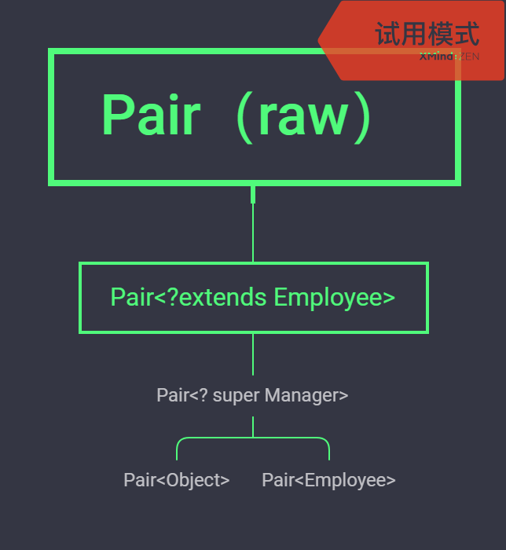

# 泛型程序设计

## 泛型的好处

泛型对于集合类来说至关重要。type parameter 

在Java SE 1.7后可以在构造函数中省略参数类型

```java
ArrayList<String> files =new ArrayList<>();
```

泛型使得程序有更好的可读性和安全性。

使用泛型的挑战：

1. 在类型参数有复杂的类之间的关系（通配符?）??????

## 泛型类与泛型方法

### 泛型类

泛型类可以看成是普通类的工厂。

### 泛型方法

定义一个简单的泛型方法

```java
class ArrayAlg
{
    public static <T> T getMiddle(T...a){
        return a[a.length/2];
    }
   
}
```

泛型方法可以定义在泛型类中，也可以定义在普通类中。

泛型对于编译器的一个重要的点就是编译器可以通过推断类型来减少调用减少添加类型参数。

```java
//调用泛型方法
String middle = ArrayAlg.<String>getMiddle("f","fsd","fs");
//简写形式由编译器推断出来这个方法的类型参数（由方法的参数列表退出）。
String middle = ArrayAlg.<String>getMiddle("f","fsd","fs");

```

但是对于这种情况

```java
double  middle = ArrayAlg.getMiddle(3.14,1729,0);

```

在这种情况下，编译器会自动打包参数为一个Double和两个Integer对象，而后寻找这些类的共同超类。事实上能够找到两个这样的超类型，Number 和Comparable接口，（本身已是一个泛型类）

如何查看编译器最终推出的泛型类型？

```java
故意引入一个错误
```

如果是这种情况编译器不能推出类型

```java
Son<Comparable<Integer>> son =new Son<Comparable<Integer>>(1, "x");//这里声明的类型参数是一个接口所以不能推出后面实际的类型。
```


## 泛型代码与虚拟机

### 类型擦除

虚拟机没有泛型类对象所有对象都是普通类（内部类也是普遍类）。

擦出类型变量，并替换为限定类型（无限定的时候就用Object）如果有多个限定的话，就会替换为限定列表的第一个限定类型。（所以为了效率的提高，应该将标签类（tagging）接口（没有方法的接口放在后面））

### 翻译泛型表达式

当程序调用泛型方法是，如果擦出返回类型，编译器插入强制类型转换。如下的例子：

```java
Pair<Employee> buddies = ...;
Employee buddy = buddies.getFirst();
```

编译器会自动插入Employee的强制类型转换。编译器会将这个方法的调用转换为两条虚拟机指令。

```java
1. 对原始方法的调用
2. 将返回的Object强转为Employee
```

```java
Employee buddy = buddies.body ;
//存取一个泛型域时也要插入泛型转换
```


### 翻译泛型方法

泛型擦出也发生在泛型方法中（擦出后就只有一个方法）

如果继承的一个类是一个泛型类那么由于泛型擦出就会出现，让泛型类参数的的方法变为原始类型，这样子类中的方法就和父类的方法变为了两个完全不相同的方法（参数发生了变化）破坏了多态性质，所以为了修复这种情况使用桥方法将带有擦出后的方法覆盖掉。（但是不加桥方法也行）

```java
桥方法被合成来保持多态


```


### 调用遗留代码

对于在没有实现泛型之间的类中填入泛型的参数可能造成这个类型警告

```java
//产生一个warning
slider.setLabelTable(lablelTable);
//因为这个类的方法可能是这样定义的
class slider{
    ...
    public void setLabelTable(LabelTable var1){
        ...
    }
    //而不是
    public void setlabelTable(LabelTable var2){
        //这样就可以使得编译器能够检查类型安全。
    }
}
```


## 类型变量的限定

```java
<T extends BoundingType> 
/**
bounding Type 可以是类也可以是接口
*/
<T extends BoundingType1 & BoundingTyp2>
/**
使用&就可以指定多个限制但是这些限制只能能有一个类，而且如果若果有一个类在其中它必须凡在这个限制列表的第一位。
*/
```


## 泛型的约束与限制

### 不能用基本类型来实例化类型参数


### 运行时类型查询只适用于原始类型

所有的类型查询只产生原始类型

```java
if(a instanceof Pair<String>)//这只能测试这个类是否属于任意的一个
pair类,a可能是Pair<Double> ,也可能是Pair<Integer>
```

为了提醒这个错误：在试图查询一个对象是否属于某个泛型类的时候，倘若使用instanceof 会得到一个编译错误，强转类型装换会的到一个警告。

### 不能创建参数化类型的数组

由于类型擦出的存在那么就会使得这个数组变为Object类型，那么这个数组记住的类型就是Object，使得数组安全机制无效。

可以声明一个泛型数组

```java
Pair<String> table=(Pair<String>[]) new Pair<?>[10];
```

这样是不安全的，失去了数组能记住它初始时类型的安全机制。

唯一的泛型安全数组ArrayList<>

编译器所作的工作就是进行类型检查（和解决一些将一些高级特性的解析（如在泛型中为泛型类加入强制类型转换，实现泛型的参数安全，生成桥方法维护由于虚拟机层次造成的多态破坏））而虚拟机只负责执行这些已经处理过的代码（不管是否泛型）。

### Varags警告

是指可以在可以为方法在传入可变参数的时候可以让编译器放松规则允许这样得出一个泛型数组（如下代码所示）。

可以利用Varags创建泛型数组，不过会有类型安全的隐患（数组中记住的类型时被泛型擦出的类型）

```java
  public T[] getArrayByVarargs(Collection<T> coll,T ...s){
        return s;
    }
T[] array=getArrayByVarags();

```

避免这种情况

1. 给方法提供一个构造器：

```java
public static<T extends Comparable[]> minmax(IntFuncton<T[]> constr,T ...a){
    T[] mm =constr.apply(2);//给定一个长度，会构造一个指定长度，类型，的数组,这样数组原始记住的类型就不是一个被擦出后的类型。数组的安全机制恢复了。！！！
    //这里IntFunction<T[]>是一个构造器：如果是String[] 的话就是String[]::new
    通过使用这种方式构造一个真正想要的数组（这个数组的内存会记住这个有构造器构造类型的值是类型安全的数组），然后将方法参数列表中的参数全部填入进去。（完美）
        
    
}   
```

还有通过一个反射的老式方式：

```java
public static<T extends Comparable>T[] minmax(T ...a){
    T[] m=(T[]) Array.newInstance(a.getClass().getComponentType(),2);
} 
```

但是上面的额方法都有成分类型

如果如在ArrayList中生成一个泛型数组

```java
public T[] toArray(){
    //这里就没有提供实际的参数没有实际的参数构造器，没有实际的实例传入无法获得这个对象的class实例他构造的是一个不安全的原始类型的数组。
    //但是：考虑它的添加函数：
    
}
public void add(T s){//这里就有参数类型检测守住了进入数组 的大门
    ...
}
```


### 不能实例化类型变量

对于类型参数T

不能够调用T.class.newInstance();(因为最终T会被擦出为原始类型)

如果想在方法中构建如 T t=new T()的样子；

```java
public Pari(){frist =new T();}//error
//真确的方式如下
Pari<String> p=Pair.makePair(String::new);//true
//在makePari中
public static <T> Pari<T> makePair<Supplier<T> constr)
{
    //Supplier<T>一个函数接口（这里可以用函数引用传入）
    return new Pair<>(contr.get(),constr.get());
    //这样就可以T的实例了
}
/**
为什么这样就可以了呢？
如果直接调用的话就是T.class到虚拟机执行的时候就会因为泛型擦出而造成，只返回的是原始类型（所以在编译器的层面就会被禁止）但是如果通过这个函数式接口（它也是泛型的）里面的代码将这个泛型实质的强转过来。
*/
```

不能通过T.class.newInstance(); 像传统反射的那样创建一个泛型实例。

使用以下的方法获得一个T.class

```java
public static <T> Pair <T> makePair(Class<T> cl){
    try{return new Pari<>(cl.newInstance(),cl.newInstance());
        catch(Exception e){
            return null;
        }
       }
}
Pair<String> p =Pair.makePair(String.class);
//由于泛型擦除的原因我们不能直接从参数类型中获得它的class。
//我们借助于这个实例（class的）来通过newInstance()来创建一个这样的class实例。
```

Class 类泛型的。String.class是Class<String>的一个实例。 

### 不能构造泛型数组

不能的原因：

1. 数组会填充null值
2. 数组类型会被擦除。

```java
      Integer [] s=getArray(1,2,3,null);
        System.out.println(Arrays.toString(s));
/*
输出结果
[1, 2, 3, null]
*/
```


### 泛型类的静态上下文无效


### 不能抛出或捕获泛型类的实例

一个类不是泛型但是它的子类可以是泛型的。

泛型类扩展Throwable都是不合法的。(原因不知道。。。可能是在记录这个错误是的堆栈信息时如果使用了这样的泛型，里面的一些强制转化会造成一些性能和一些操作的影响)。

```java
public class Problem<T> extends Exception{}//不可以继承Throwble
```


首先在catch子句中不能使用类型变量

```java
public static <T extends Throwable> void doWork(Class<T> t){
    try{
        //do work
    }
    catch(T e){//这是非法的。。。
        Logger.global.ingo(...);
    }
}
```

但是在异常规范中使用类型变量是允许的：

```java
public static <T extends Throwable >void doWork(T t) throws T {//这是合法的。
    try{
        。。。
    }
    catch(Throwble realCause){
        。。.
    }
}
```


### 可以消除对受查异常的检查

java异常的基本原则：必须为所有受查异常提供一个处理器。不过可以利用泛型消除这个限制。

```java
public static <T extends Throwable> void throwAs(Throwable e) throws T{
    throw(T)e;
} 
block.<RuntimeException>throwAs(t);
这样编译器就会认为t 是一个非受查异常

```

在线程中的run（不可以抛出受查异常）函数可以利用这一点，哄骗编译器这不是一个受查异常。

### 注意擦出后的冲突

```java
    public boolean equals(T Value) {

    }//这是不合法的 因为我们想要的是一个接受一个例如String这样指定的参数，而不是擦除后的原始类型，这样就覆盖了这个方法不符合我们的初衷。
```

要想支持擦出的装换就需要强行限制一个类或类型变量不能同时成为两个接口类型的子类，而这两个接口是同一个接口的不同参数化。例如，下述代码是不合法的。

```java
class Employee implements Comparable<Employee> {...}
//employee实现了一个泛型接口
class Manager extends Employee implements Comparable <Manager>//出现错误；manager 继承的两个不同参数化的接口
```

如果实现的都是同一个参数类型的接口的话那么这种情况是被允许的。如在java api中的这个AbstractList中。

但是在非泛型的版本中

```java
class Employee implements Comparable<Employee> {...}
class Manager extends Employee implements Comparable<Manager>{}这是合法的虽然有些没有必要和啰嗦。
```

可能与实现桥方法的合成有关系。？？？？？？？？？？？？

## 泛型类型的继承规则

1. Pair<Son> 不是Pari<Parent>的子类两者没有什么关系。
2. 但是Pair<Son>和Pair<Parent>都可以转为Pair<>;

```java
class class1<T> {
    public T f(T p){
        return p;
    }
}
class class2<T> extends class1<Integer>{
    public T f(T p){
        return p;//这里编译器会提示出错不能这么写由于两个都存在擦出。不存在这种多态关系。
    }
}
```


```java
class class1<T> {
    public T f(T p){
        return p;
    }
}
class class2<T> extends class1<T>{
    public T f(T p){
        return p;
    }
}
```

```java
class class1<T> {
    public T f(T p){
        return p;
    }
}
class class2<T> extends class1<Integer>{
    public Integer f(Integer p){
        return p;
    }
}
```

编译器检测这种泛型方式的方法覆盖时，只要看纸面意思就够了，我们只要把这些个泛型类当成普通的类就能知道这些方法是否合法。

## 通配符类型

允许类型参数变化

```java
Pair<? extends Employee>
```

泛型类中的继承关系


这样就可以这样声明了

```java
Pari<Manager> manager =new Pari<>(ceo,cfo);
Pair<? extends Employee> wxx =manager;//在泛型类中实现堕胎了
wxx.setFirst();//但是这里并不会给manager对象造成破话这里会出现错误?不能匹配任何的类型。拒绝传入任何的特定的类型
```

在非泛型的子类与父类的方法调用中虚拟机遵循多态的准则

在这种泛型的继承关系中

```java
//在Pair <? extends Employee> 中不能造成多态 
```


### 通配符概念 

### 通配符的超类限定

```java
? super Manager //指定一个超类限定，限制为Manager的所有超类型。
```

它其中的方法就变为

```java
? super Manager getFirst();//只能获得object类型的值
void setFirst(? super Manager);//无法获知具体参数类型不能传递可以传递Manger（它的父类都不能传因为父类不一定等于子类）的实例
```




实例：

 ```java
  public static <E extends Comparable<? super E>> E min(E a)
 ```

限定类型参数。

在Collection 接口中的一个方法

```jav
default boolean removeIf(Predicate<?super E>filter ){

}
```


通配符是给一个限定给传入的参数（如方法的参数和类的类型参数）让这个参数能够接受检测以及一些子类，超类的限定（还展示出一些多态的特征）。但是当其T在方法中的自动转换时这是？不会匹配任意的其它类型除了本类型。

如下

```java
public class <T> A{
    public T f(T e){
        
    }

}
可以通过这样的方式 A<? extends/super A> a= new <..>A();
但是 a.f().这个时候方法参数的类型检查就很严格，不能传递任何特定的类型。
也可以通过多态中类方法的调用来查看这种关系
对于？extends /super .. 是具体泛型类的子类，当父类的类型变量声明为了一个子类时那么就是实现了多态，在调用它的一个方法时jvm会调用原始类型的方法，但是如果匹配不上参数那么就会返回上级方法上级是通配符（不能指定任何特定的类型多态链也就终止了），如果一个通配符声明为了 ？extends employee 那么将 <manager>赋值给它，这是其中的方法 set(T e )不应该 接受它employee的类型。它应于原始类型的方法参数保持一致。
对于 super 传入参数的时候也是一样的道理。但是返回参数由于父类向上的关系不能够知道准确的类型所以使用Object返回。
泛型类的继承关系，应该于参数的继承关系分开（他们的参数有继承关系于它们类之间的继承关系是无关的）
但是调用 set(null)都是合法的。
```


### 无限定的通配符

List<?> 这个不管？是什么，但是都是一样的。比如可以是List<Integer>,也可以是 List<String>，但是不管？是什么，list里元素是一样的。都是integer或者是string的类型

但List list里没有限制，同一个list里，list(0)可以是Iteger,而list(1)可以是String,即其每个元素可以不一样。

无限定通配符表示匹配任意类。`ArrayList<?>` 和 `ArrayList`，`ArrayList<Object>` 看上去功能有点类似，但实际却不一样。 `ArrayList<?>` 是任意 `ArrayList<T>` 的超类，而我们知道 `ArrayList<Object>` 并不是。`ArrayList<?>` 虽然可以匹配任何类，我们并不知道那个类的类型，但我们知道里面的所有元素都有相同的类。而原始类 `ArrayList` 可以添加任意不同类型的元素，编译器并不能进行类型判断，但运行的时候可能会抛出异常。`ArrayList<Object>` 明确的告诉我们可以添加任何类型的对象。

`Collection<?>` 是任意 T `ArrayList<T>` 的超类，可以编译通过。但是，在`printCollection` 方法中，却不能使用任何带有类型参数的方法，比如 `add(T t)`, 而 `remove(Object obj) contains(Object obj)` 等方法都是可以调用的。


```java
public class GenericTest07 {
    public static void printCollection(Collection<?> col1) {
        for (Object obj : col1) {
            System.out.println(obj);
        }
    }

    public static void main(String[] args) {
        List<Integer> list = new ArrayList<>();
        list.add(1);
        list.add(2);
        printCollection(list);  
    }
}
```


### 通配符的捕获

案例场景：交换两个数

```java
public static void swap(Pair<?> p){
    //? 不能写在编码中。
}

```

```java
public static  <T> void  swapHelper(Pair<T> p){
    //这是一个捕获器捕获了通配符？。
}
public static void swap(Pair<?> p){
    swapHelper(p);
}
```


## 反射与泛型

使用class<T>避免参数转换。

### 泛型Class类


### 使用Class<T> 参数进行类型适配

在方法参数写Class 与Class<T> 的区别。

### 虚拟机中的泛型信息

泛型类在虚拟机中会留有一定的残留记忆。	

