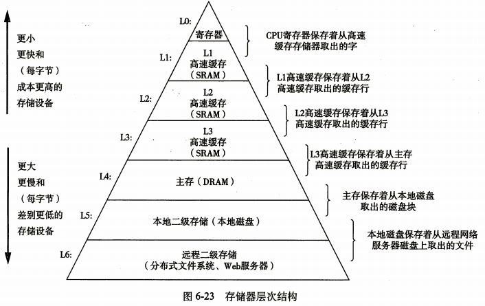

# 5.存储器

## 5.1存储体系概述

### 5.1.1存储器的分类

#### 1.按介质分

1. 磁盘（硬盘）
2. 光盘

#### 2.按存取方法存取

1. 随机存取
2. 顺序存取（存储的时间与存储的位置有关）

####  3.按功能分

#### 4.

1. rom(只读)
2. 易失性 ram

#### 5.按在计算机中的作用分类

1. 主存储器
2. 辅助存储器

#### 6.主存储器的分类

1. prom

2. eprom eeprom 散存

3. rom

   

4. ram 

   1. sram (高速缓存)
   2. dram

#### 7.辅存的分类

### 5.1.2存储器的性能指标

#### 存储容量

存储单元个数*每个存储单元的二进制位数

#### 存储周期

#### 存储时间

*一次存储操作的时间*

#### 存储的带宽

*每次可存储多少位*

#### 存储的价格

*存储的每位价格*

#### 存储的功耗

存储的功耗与存储器的大小有关 ，越低越好

#### 存储器的可靠性

###  5.1.3存储器的层次结构

## 5.2 主存储器

### 特点：

通过地址总线（AB) 控制总线（CB）数据总线（DB）

### 5.2.1 随机读取存储器 RAM

#### sram

1. 存储位元

2. 译码方式

   1. 线性译码
   2. 双向译码

3. 2114SRAM

   1. 片选信号

4. 特点

   相对性比较，用作cache

   断电时信息不保存

#### dram

1. 存储位元

   双稳态

   由于电容有漏电特性，（经过一定时间）就要不断充电（刷新）

2. 结构

   （电路结构图）行列地址双向译码

   行地址和列地址分时复用

3.  读写过程

   时序图

4. 刷新：（只要行地址）

   刷新周期

   对于多个芯片：所有行同时进行刷新（选中所有芯片）

   单元刷新间隔时间：对于电容中的电荷最大保存时间（信息保存的最长时间）

   刷新方式

   1. 集中式刷新

      刷新时间（死区：cpu无法进行操作）

   2. 分散式刷新

      刷新周期缩短刷新时间变长

   3. 移步式

      混合式

5. dram 的特点

   功耗大--》集成度小（做为主存）

   速度较慢--需要刷新，行列复用

### 5.2.2 ROM

### 5.2.3 高性能的主存储器

edram

cdram

edo ram

dsram	

rdram

ddr (ddr sdram)

## 5.3 主存储器与cpu的连接

### 5.3.1 存储芯片简介

1. sram的引脚
2. dram的引脚
3. rom芯片的引脚

### 5.3.2 存储器的扩展

1. 位扩展

   要点：

2. 字扩展

   存储容量的扩展

   有片选信号

3. 字位扩展

### 5.3.3 cpu与主存储器的连接

1.主要步骤

1. 根据cpu提供的地址线数目，确定访存的地址范围，并写出相应的二进制地址码
2. 根据地址范围的容量，确定各种类型芯片的数目和扩展方法
3. 分配cpu地址线，高位位片选信号
4. 连接数据线，R/W# 等其他信号，MREQ#一般可用作地址译码的使能信 号。（24译码器，38译码器 # :代表低电平有效等于上面写一横线）

2.解释

1. 38译码器三个输入端（能组成8种片选信号）8个输出信号低电平有效直接输出某一个片有效的信号（直接输入到某一片存储芯片）。

3.问题

1. 有若干片 的256\*sram芯片，要构成2048k\*32位的芯片问：

   1. 要多少片的芯片？
   2. 存储器要多少根的地址线？
   3. 画出cpu的连接口信号？

2. 注意：**地址线的数量和位数是无关的**

3. 0000H~3FFFH rom区  4000H~5FFFH保留区 6000H~FFFFH ram区

   按不同条件求分配方案？

   注意如果采用4k这种芯片（不是8k一组的情况）。

4. 

